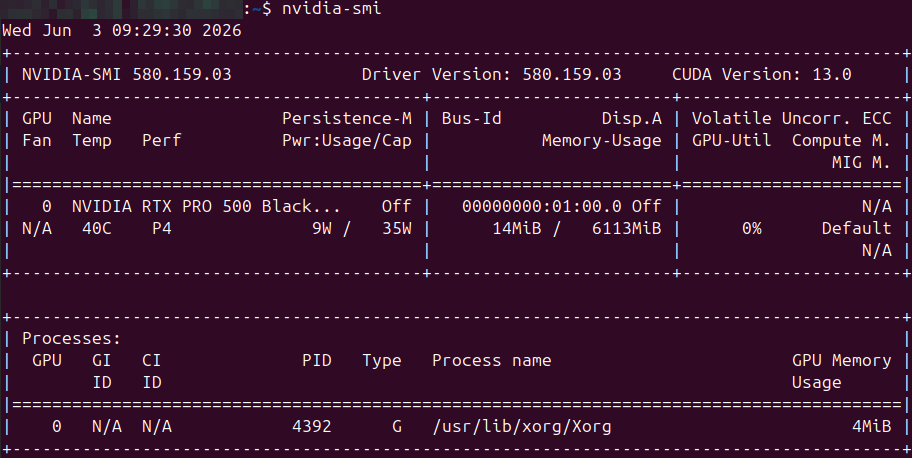
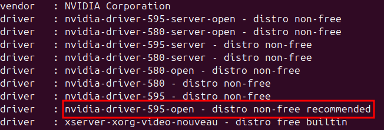
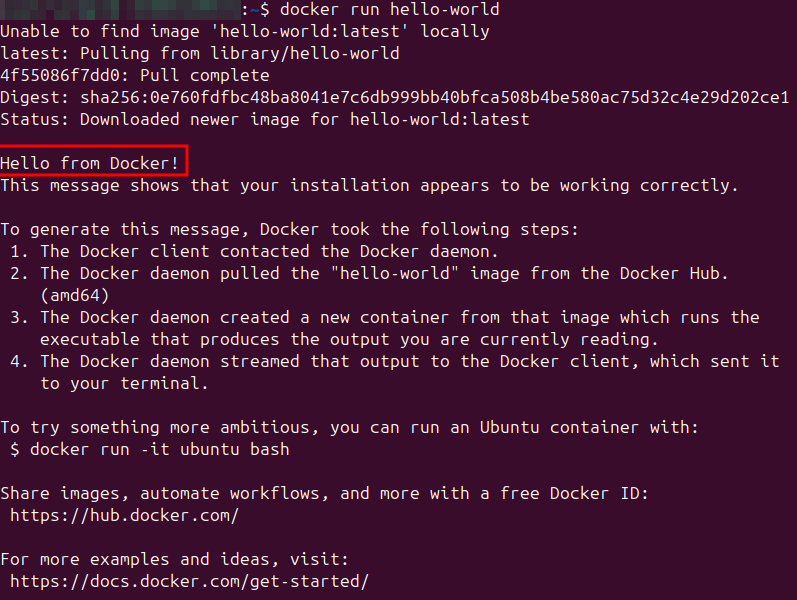
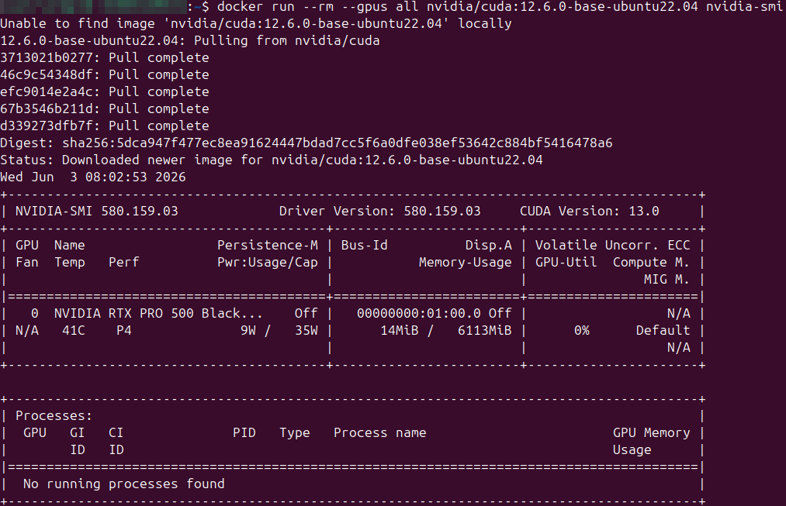

# Docker & NVIDIA Container Toolkit on Ubuntu - Setup Guide

This guide walks you through installing Docker on Ubuntu, verifying the installation, and setting up the NVIDIA Container Toolkit so your containers can access your GPU's power.

## 0. Introduction & Key Concepts

### What are these tools?
*   **The Terminal:** This is the text-based interface used to control your computer. On Ubuntu, open it with **`Ctrl + Alt + T`**.
*   **Docker:** A tool that packages applications into isolated "containers."
*   **NVIDIA Container Toolkit:** The "bridge" that allows Docker to use your NVIDIA GPU for AI or rendering.
*   **nvidia-smi:** A command-line utility that communicates with your NVIDIA driver to show GPU usage and temperature. **If this command fails, your GPU cannot be used by Docker.**

---

## Prerequisites

- Operating system: Ubuntu 20.04, 22.04, or 24.04 (64-bit) with an NVIDIA GPU.
- A user account with `sudo` privileges.
- **NVIDIA Drivers:** These must be installed. Test this by typing `nvidia-smi` in your terminal. 
    *   *If it works:* You should see a table with GPU details. If so, proceed to [Section 1](#1-install-docker).
    <p style="text-align: left;">
      
      <br>
      <em>Figure 1 - Expected output of nvidia-smi.</em>
    </p>
    
    *   *If it fails (e.g., "command not found" or "no devices found"):* Follow [Section 0.1](#01---installing-nvidia-drivers-if-needed) below

---

## 0.1 - Installing NVIDIA Drivers (if needed)
**Important Warning:** Driver installation and management is a critical system-level task. **We strongly recommend only experienced users attempt this**, as incorrect driver versions or installation methods can lead to system instability, boot loops, or display issues. If unsure, **seek advice from someone who has experience with Linux or GPU driver management**.

If `nvidia-smi` does not work, you need to install the drivers on your host machine first.

### A. Detect your GPU and recommended driver
Run the following command to see which driver is recommended for your hardware:
```bash
ubuntu-drivers devices
```

Look for the line that identifies a driver as `recommended` with the vendor being NVIDIA Corporation.

<p style="text-align: left;">
  
  <br>
  <em>Figure 2 - Output of ubuntu-drivers devices showing a recommended NVIDIA driver.</em>
</p>
    
### B. Install the driver
You can either install the recommended one automatically:
```bash
sudo ubuntu-drivers autoinstall
```
**OR** install a specific version (e.g., version 550) manually:
```bash
sudo apt update
sudo apt install -y nvidia-driver-550
```

### C. Reboot
For the driver to activate, you **must** restart your computer:
```bash
sudo reboot
```

### D. Verify
After rebooting, open your terminal and type:
```bash
nvidia-smi
```
If you see a table showing your GPU name and driver version, you are ready to proceed to Section 1.

If not, check the official ubuntu documentation for troubleshooting: https://ubuntu.com/server/docs/how-to/graphics/install-nvidia-drivers/

---

## 1. Install Docker
Open your terminal and run these commands:
### 1.1 - Remove old versions
```bash
sudo apt remove docker docker-engine docker.io containerd runc
```
> **Note:** If you see `E: Unable to locate package docker-engine`, it's normal. It just means it wasn't there.

### 1.2 - Install dependencies
Refresh the package lists, then install essential tools: trusted SSL certificates, curl for HTTP requests, and gnupg for verifying cryptographic signatures:
```bash
sudo apt update
sudo apt install -y ca-certificates curl gnupg
```

### 1.3 - Add Docker's official GPG key and repository
Create a trusted key storage folder, download Docker’s GPG signing key, and add Docker’s official repository for your Ubuntu version:
```bash
sudo install -m 0755 -d /etc/apt/keyrings
curl -fsSL https://download.docker.com/linux/ubuntu/gpg | sudo gpg --dearmor -o /etc/apt/keyrings/docker.gpg
sudo chmod a+r /etc/apt/keyrings/docker.gpg

echo \
  "deb [arch=$(dpkg --print-architecture) signed-by=/etc/apt/keyrings/docker.gpg] \
  https://download.docker.com/linux/ubuntu \
  $(. /etc/os-release && echo "$VERSION_CODENAME") stable" | \
  sudo tee /etc/apt/sources.list.d/docker.list > /dev/null
```

### 1.4 - Install Docker Engine
Refresh the package indexes, then install Docker Engine, its CLI, the container runtime, and useful plugins:
```bash
sudo apt update
sudo apt install -y docker-ce docker-ce-cli containerd.io docker-buildx-plugin docker-compose-plugin
```

### 1.5 - Run Docker without `sudo`
Add your current user to the docker group to run commands without sudo, then start a new shell session to apply the changes:
```bash
sudo usermod -aG docker $USER
newgrp docker
```

---

## 2. Verify the Docker Installation
Run the following command to test your Docker installation:
```bash
docker run hello-world
```
If you see `"Hello from Docker!"`, like in this image, Docker is working.
<p style="text-align: left;">
  
  <br>
  <em>Figure 3 - Expected output of docker run hello-world.</em>
</p>

If you get an error when running Docker (like permission denied or “cannot connect to the Docker daemon”), it’s very likely because you skipped step 1.5. 
If you still get an error, check the official Docker documentation for troubleshooting: https://docs.docker.com/desktop/setup/install/linux/

---

## 3. Install the NVIDIA Container Toolkit

### 3.1 - Configure the repository
Add NVIDIA’s GPG key and configure APT to trust packages from the NVIDIA Container Toolkit repository:
```bash
curl -fsSL https://nvidia.github.io/libnvidia-container/gpgkey | \
  sudo gpg --dearmor -o /usr/share/keyrings/nvidia-container-toolkit-keyring.gpg

curl -s -L https://nvidia.github.io/libnvidia-container/stable/deb/nvidia-container-toolkit.list | \
  sed 's#deb https://#deb [signed-by=/usr/share/keyrings/nvidia-container-toolkit-keyring.gpg] https://#g' | \
  sudo tee /etc/apt/sources.list.d/nvidia-container-toolkit.list
```

### 3.2 - Install the toolkit
Refresh the package lists, then install NVIDIA’s container runtime tools to enable GPU support:
```bash
sudo apt update
sudo apt install -y nvidia-container-toolkit
```

### 3.3 - Configure the Docker runtime
Configure Docker to use the NVIDIA container runtime so containers can access the GPU, then restart Docker to apply the changes:
```bash
sudo nvidia-ctk runtime configure --runtime=docker
sudo systemctl restart docker
```

---

## 4. Test GPU Access Inside a Container

### 4.1 - Quick smoke test
Run the following command to test if your container can see your GPU:
```bash
docker run --rm --gpus all nvidia/cuda:12.6.0-base-ubuntu22.04 nvidia-smi
```

If everything is correctly installed, you should see your GPU information displayed (similar to Fig. 3).
<p style="text-align: left;">
  
  <br>
  <em>Figure 4 - Expected output of nvidia-smi inside a Docker container.</em>
</p>


### 4.2 - Target a specific GPU
Run this command to force the container to use only GPU 0. You should see the same nvidia-smi output, but restricted to the selected device:
```bash
docker run --rm --gpus '"device=0"' nvidia/cuda:12.6.0-base-ubuntu22.04 nvidia-smi
```

---

## 5. Conclusion

You now have a fully working environment with:

- Docker installed and running  
- NVIDIA drivers configured on your host  
- NVIDIA Container Toolkit enabled  
- GPU access verified inside containers  

This setup allows you to run GPU-accelerated workloads such as AI inference, machine learning training, and CUDA-based applications directly inside Docker containers.