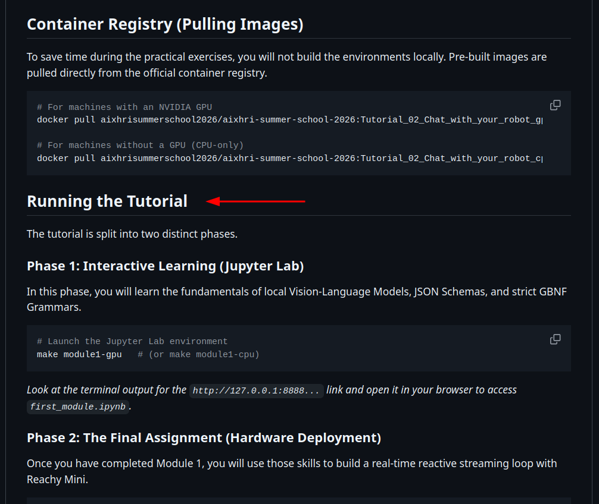

# Tutorial 02 : Chat with robots

## 1. Dowload the tutorial

> It is **recommended** to use the [`run_all_setup.sh`](./run_all_setup.sh) script to download the entire codebase. If you prefer to download only this tutorial, you can instead follow the instructions below.

If you haven't already, clone this repository and navigate to the tutorial directory:
```bash
git clone https://github.com/aixhri-summer-school-2026/docker-tutorials.git
cd docker-tutorials/Tutorial_02_Chat_with_your_robot
```

Make the tutorial setup script executable:
```bash
chmod +x setup_tutorial_02.sh
```

Run the setup script and specify the destination directory where the tutorial should be installed. The script will automatically create the target directory if it does not exist and set up all the required files.
```bash
./setup_tutorial_02.sh <path_to_directory>/Tutorial_02_Chat_with_your_robot
```
For example:
```bash
./setup_tutorial_02.sh ~/aixhri-summer-school/Tutorial_02_Chat_with_your_robot
```

## 2. Run the tutorial

Once the tutorial is publicly available, the complete instructions will be available at:

[`https://github.com/aixhri-summer-school-2026/Tutorial_02_Chat_with_your_robot`](https://github.com/aixhri-summer-school-2026/Tutorial_02_Chat_with_your_robot)

You can therefore follow the main tutorial **while skipping the image pulling command**.

First, navigate to the tutorial directory:
```bash
cd ~/aixhri-summer-school/Tutorial_02_Chat_with_your_robot
```

Update the repository to ensure you have the latest version of the tutorial:
```bash
git pull
```

Install udev rules (USB + camera symlink):
```bash
sudo bash scripts/usb_permissions.sh
sudo bash scripts/camera_rules.sh
```

You can then resume the tutorial from the section shown below:
<p style="text-align: left;">
  
  <br>
</p>

You can now download the next practical session: [Tutorial_03_Flow_Matching](../Tutorial_03_Flow_Matching)