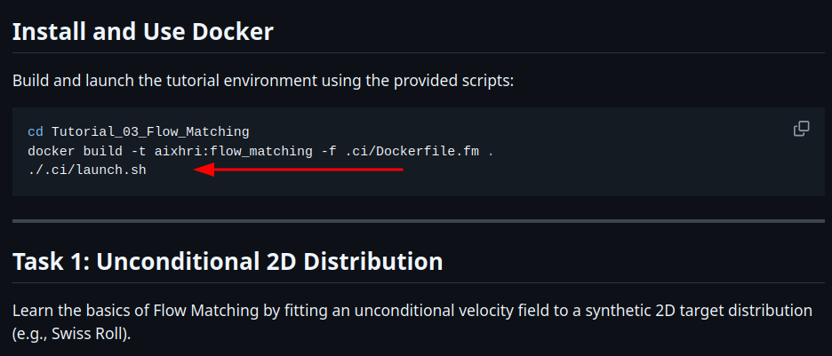

# Tutorial 03 : Flow Matching

## 1. Download the tutorial

> It is **recommended** to use the `run_all_setup.sh` script (located in the root of `docker-tutorials`) to download the entire codebase. If you prefer to download only this tutorial individually, you can instead run the `setup_tutorial_??.sh` script provided inside the tutorial folder.

Make sure you have cloned this repository and are currently inside the correct directory:
```bash
cd docker-tutorials/Tutorial_03_Flow_Matching
```

Make the setup script executable:
```bash
chmod +x setup_tutorial_03.sh
```

Run the setup script and specify the destination directory where the tutorial should be installed. The script will automatically create the target directory if it does not exist and set up all the required files.
```bash
./setup_tutorial_03.sh <path_to_directory>/Tutorial_03_Flow_Matching
```
For example:
```bash
./setup_tutorial_03.sh ~/aixhri-summer-school/Tutorial_03_Flow_Matching
```

## 2. Run the tutorial

Once the tutorial is publicly available, the complete instructions will be available at:

[`https://github.com/aixhri-summer-school-2026/Tutorial_03_Flow_Matching`](https://github.com/aixhri-summer-school-2026/Tutorial_03_Flow_Matching)

You can therefore follow the main tutorial **while skipping the image build command**.

First, navigate to the tutorial directory:
```bash
cd ~/aixhri-summer-school/Tutorial_03_Flow_Matching
```

Update the repository to ensure you have the latest version of the tutorial:
```bash
git pull
```

You can then resume the tutorial from the section shown below:
<p style="text-align: left;">
  
  <br>
</p>

You can now download the next practical session: [Tutorial_04_FlowerVLA](../Tutorial_04_FlowerVLA)