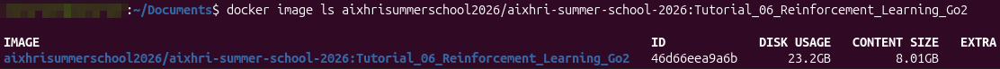
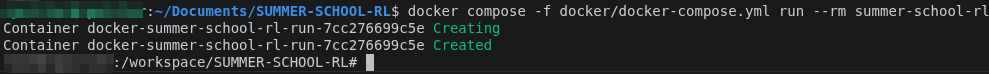

# Tutorial 04 : FlowerVLA

This README explains how to retrieve the project code, download the required Docker image, and run the container in an isolated environment.

<!-- # 1. Download the code

You need to download the repository containing the configuration files and the code for the practical session. We use Git to clone the repository from GitHub to your local machine:

```bash
git clone 
```

# 2. Download the image

Run the following command:

```bash
docker pull aixhrisummerschool2026/aixhri-summer-school-2026:Tutorial_01_Finetuning_LLM
```
It downloads the pre-built environment on your local machine that contains all the librairies, dependencies and tools for the practical session.

## 2.1 Verify that the image has been pulled

You can run:
```bash
docker image ls aixhrisummerschool2026/aixhri-summer-school-2026:Tutorial_06_Reinforcement_Learning_Go2
```
You should see output similar to the following:
<p style="text-align: left;">
  
  <br>
</p> -->

You can now download the next practical session: [Tutorial_05_RL_Human_Feedback](../Tutorial_05_RL_Human_Feedback)

---

<!-- # 3. Starting the Practical Session

## 3.1 - Enable graphical display (X11)

Before launching the container, you need to grant Docker permission to connect to your local display. This is required to open windows for graphical applications like MuJoCo, mjlab, and Pygame. 
Run this command:
```bash
xhost +local:docker
```

## 3.2 Launch the container

Now, start the interactive session using Docker Compose:
```bash
cd SUMMER-SCHOOL-RL
docker compose -f docker/docker-compose.yml run --rm summer-school-rl
```

You should now be inside the Docker container! Your terminal prompt will change to reflect this.
<p style="text-align: left;">
  
  <br>
</p> -->